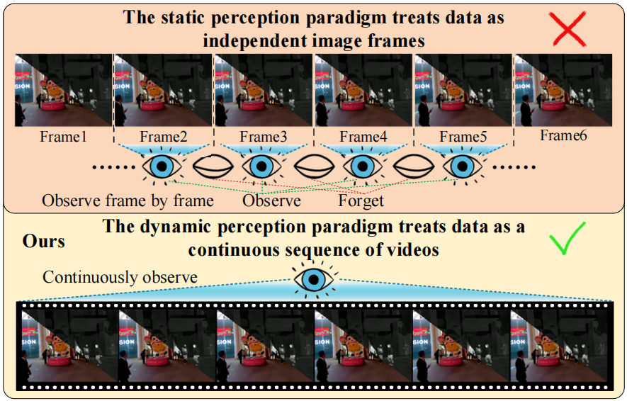
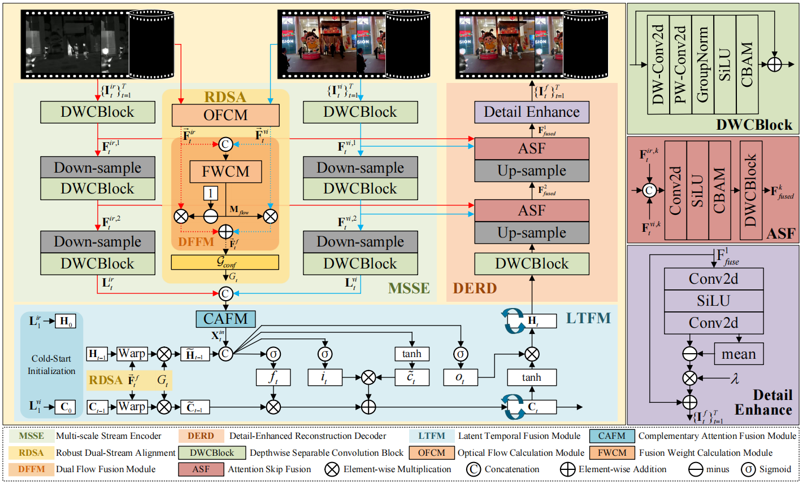
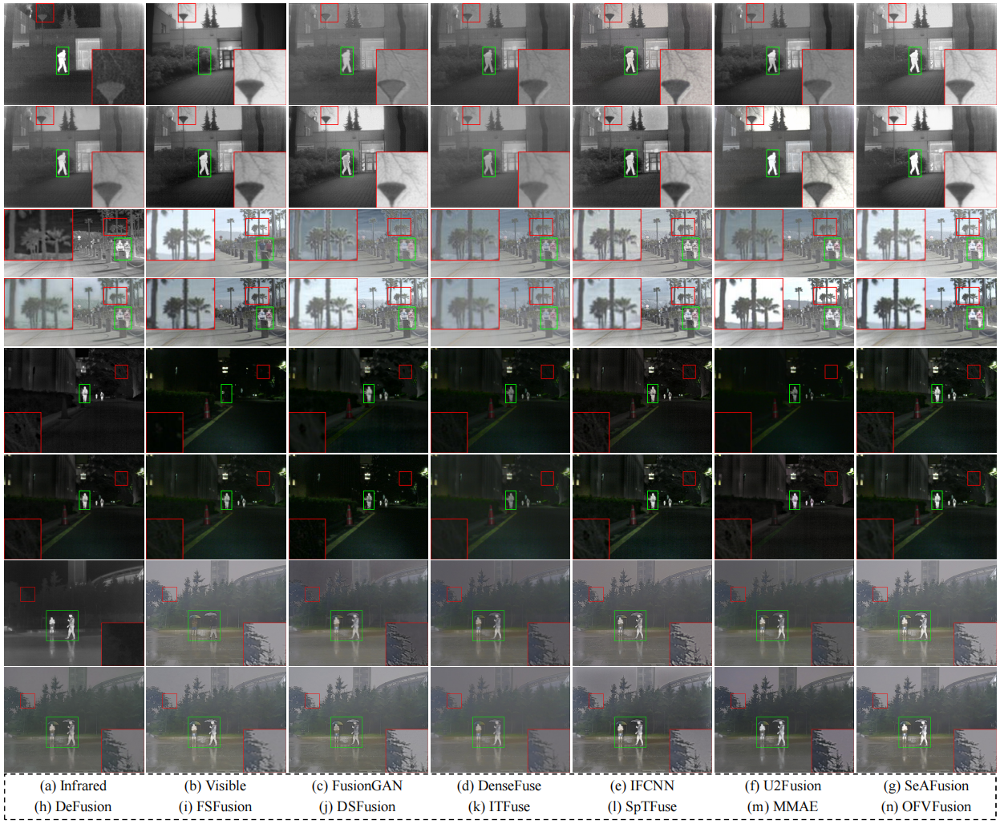
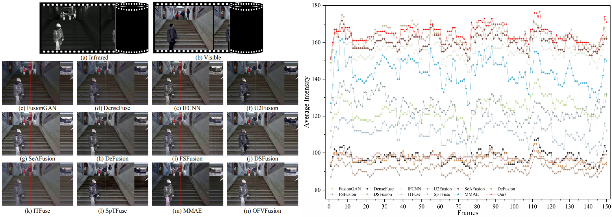
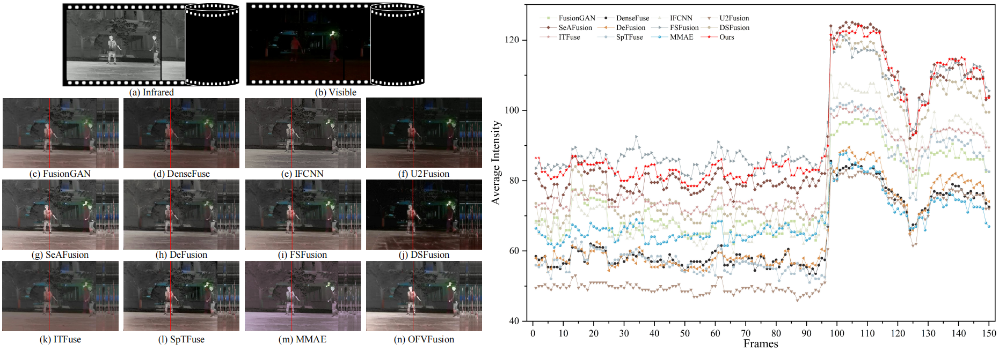
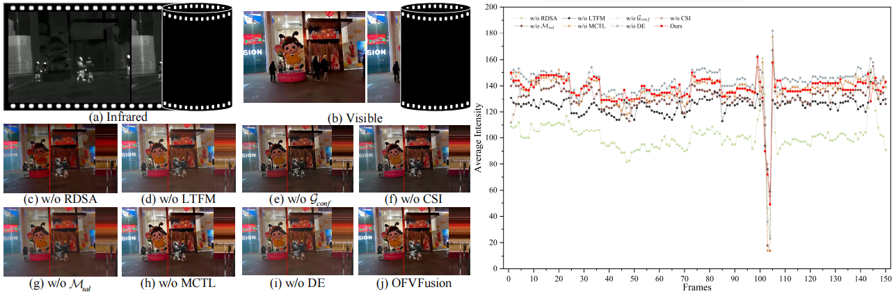

# OFVFusion🚀
This is official Pytorch implementation of "OFVFusion: Optical Flow-Guided Saliency Learning for Infrared and Visible Video Fusion"

## 📜Abstract
Infrared and visible video fusion aims to generate fused sequences that simultaneously highlight salient thermal targets and preserve rich visible textural details. However, most existing fusion methods adopt a frame-by-frame static paradigm, neglecting the inherent temporal correlations within video streams. This oversight leads to severe temporal inconsistencies, such as flickering artifacts and ghosting, particularly in dynamic scenes. To mitigate these limitations, we propose OFVFusion, a novel optical flow-guided saliency learning framework that reformulates video fusion as a sequence-to-sequence learning task. Unlike static approaches, OFVFusion explicitly models long-range temporal dependencies within a low-resolution latent space, striking an optimal balance between performance and computational efficiency. Specifically, we introduce a dual-stream motion alignment mechanism that adaptively fuses optical flows from both modalities to handle the failure of a single modality under extreme lighting, ensuring robust temporal registration. The core latent temporal fusion module, driven by a lightweight depthwise separable ConvLSTM and flow confidence gate, is designed to efficiently aggregate spatiotemporal context while effectively filtering out alignment errors. Furthermore, to compensate for information loss caused by downsampling, an attention-guided skip fusion strategy is designed in the decoder to intelligently select and recover complementary spatial details from the encoder. Finally, we propose an Instance-Adaptive Saliency Loss with learnable parameters, enabling the network to automatically optimize the trade-off between thermal prominence and texture preservation in an end-to-end manner. Extensive experiments on public datasets demonstrate that OFVFusion outperforms state-of-the-art methods in terms of both visual quality and temporal stability while maintaining superior computational efficiency.

## ✨Highlight
- A novel recurrent framework reformulates video fusion as a Seq2Seq learning task.
- Dual-stream optical flow guidance ensures robust motion alignment.
- Long-range temporal dependencies are explicitly modeled in a latent space.
- A learnable instance-adaptive loss balances thermal prominence and texture detail.
- OFVFusion achieves SOTA performance with superior computational efficiency.

## 🪢Comparison of static and dynamic perception paradigms

Comparison of static (top) and dynamic (bottom) perception paradigms. The static paradigm treats video sequences as isolated frames and neglects temporal correlations. Conversely, the dynamic paradigm mimics human vision by establishing temporal dependencies through continuous observation of the video stream.

## 🌻Network Architecture

The architecture of the OFVFusion. 

## 🪄Code Usage
### To Train
Run ```python main.py``` to train your model. The training data is obtained by extracting patches from the images in the MSRS dataset.
For convenient training, users can download the training dataset from [here](https://pan.baidu.com/s/16qbgI3HK7Y45H0GwZkc8vQ?pwd=Qi42), in which the extraction code is: Qi42.
Put this tar file into folder data.
### To Test
Run ```python test.py``` to test the model.  
M3FD dataset can be downloaded from [M3FD](https://pan.baidu.com/s/1SbqLk2YSAYr_1NKVCIeNsQ?pwd=Qi42), in which the extraction code is: Qi42.  
Put this tar file into folder data/test_data.

## 📌Fusion Example
Qualitative comparison of DWSFusion with 13 state-of-the-art methods from the TNO, RoadScene, MSRS and M3FD datasets.





## 🧷If this work is helpful to you, please cite it as：

```
aaa
```


## 😊Contact
If you have any questions, please contact 420269520@qq.com
